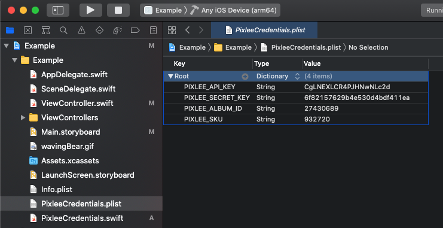
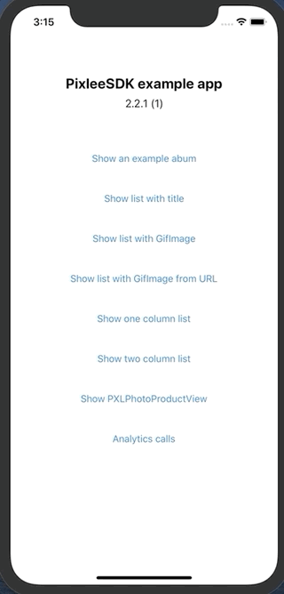
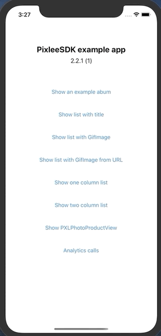

[](https://cocoapods.org/pods/PixleeSDK)
[](https://cocoapods.org/pods/PixleeSDK)
[](https://cocoapods.org/pods/PixleeSDK)

# pixlee-ios-sdk

This SDK makes it easy for Pixlee customers to easily include Pixlee albums in their native iOS apps. It includes a native wrapper to the Pixlee album API as well as some drop-in and customizable UI elements to quickly get you started. This repo includes both the Pixlee iOS SDK and an example project to show you how it's used.

### Notice: please be aware of these terms in the document. 
- the word 'content' is used in the documentation. this means a photo or video.
- The PXLPhoto class represents a piece of content, which can be a photo or video

# Table of Content
- [About the SDK](#About-the-SDK)
- [Get Started with Demo App](#Get-Started-with-Demo-App)
- [Add the SDK to your App](#Add-the-SDK-to-your-App)
    - [Option 1: Using Cocoapods](option-1-using-cocoapods)
    - [Option 2: Using Carthage](#option-2-using-carthage)
        - [If you're building for iOS, tvOS, or watchOS](#if-youre-building-for-ios-tvos-or-watchos)
- [Initiate the SDK](#Initiate-the-SDK)
- [Network API Caching](#Network-API-Caching)
- [Filtering and Sorting](#Filtering-and-Sorting)
- [Getting a PXLPhoto](#getting-a-pxlphoto)
- [Analytics](#Analytics)
    - [Add to Cart](#Add-to-Cart)
    - [Conversion](#Conversion)
    - [Opended Widget](#Opended-Widget)
    - [Opened Lightbox](#Opened-Lightbox)
    - [Action Click](#Action-Click)
    - [Load More](#Load-More)
- [Uploading an Image to an album](#Uploading-an-Image-to-an-album)
- [UI components](#UI-components)
    - [Image & Video Viewer with PXLPhoto](#Image-and-Video-Viewer-with-PXLPhoto)
    - [PXLPhotoProductView](#PXLPhotoProductView)
    - [PXLPhotoView](#PXLPhotoView)
    - [PXLPhotoListView](#PXLPhotoListView)
    - [PXLGridView](#PXLGridView)
    - [PXLItemsView](#PXLItemsView)
- [Troubleshooting](#Troubleshooting)
- [License](#License)

# About the SDK
Before accessing the Pixlee API, you must initialize the `PXLClient`. To set the API key, what can be set with the  `apiKey` property on `PXLClient.sharedClient`. You can then use that singleton instance to make calls against the Pixlee API.

To load PXLPhotos(content) in an album there are two methods https://developers.pixlee.com/reference#get-approved-content-from-album or https://developers.pixlee.com/reference#get-approved-content-for-product. 

If you are retriving the content for one album you'll want to use the `PXLAlbum` class. Create an instance by calling `PXLAlbum(identifier: <ALBUM ID HERE>)`. You can then set `sortOptions` and `filterOptions` as necessary (see the header files for more details) before calling `loadNextPageOfPhotos:` to load photos.
You can load the PXLPhotos(content) via the `PXLClient`, You just have to use the `loadNextPageOfPhotosForAlbum(album, completionHandler)`. It will load the album's content as pages, and calling `loadNextPageOfPhotos:` successively will load each page in turn with returning the newly loaded content in the completion block, and updating the album's content array to get all of the content.

# Get Started with Demo App
1. open **Example** folder in terminal.
2. run this command. ( Don't have Pod installed on your computer? [Please look in to this link to install Pod before doing this](https://guides.cocoapods.org/using/getting-started.html) )
    ```
    pod install
    ```
3. open Xcode by double clicking **Example/Example.xcworkspace** file in Finder of Mac.
4. create **PixleeCredentials.plist** in Example/Example/PixleeCredentials.plist 
    - add these 4 elements to **PixleeCredentials.plist** 
        - PIXLEE_API_KEY:(String) "replace with your own value" (https://app.pixlee.com/app#settings/pixlee_api)
        - PIXLEE_SECRET_KEY:(String) "replace with your own value" (find here: https://app.pixlee.com/app#settings/pixlee_api)
        - PIXLEE_ALBUM_ID:(String) "replace with your own value"  (find here: https://app.pixlee.com/app#albums)
        - PIXLEE_SKU:(String) "replace with your own value" (find here: https://app.pixlee.com/app#products)
        - PIXLEE_REGION_ID:(String) "replace with your own value" (find here: https://app.pixlee.com/app#products)
      

5. in Xcode, run the app by clicking **Product> Run** in the menu bar or by pressing **Command + R** on you keyboard.

# Add the SDK to your App
You can choose one of these two options to add the SDK to your app. Plase replace `PixleeSDK version` with [](https://cocoapods.org/pods/PixleeSDK).
### Option 1: Using Cocoapods
1. install and setup cocoapods with your projects https://guides.cocoapods.org/using/getting-started.html
2. Add https://cocoapods.org/pods/PixleeSDK to your Podfile by adding 
    ```
    target 'MyApp' do
      pod 'PixleeSDK', '~> <PixleeSDK version like 2.5.1>' (Replace with current version, you can find the current version at https://github.com/pixlee/pixlee-ios-sdk/releases)
    end
    ```
3. Run Pod install

If you are using Objective-C in your porject and don't want to add a framework based on swift you can use our deprecated library: https://github.com/pixlee/ios-sdk-carthage 

### Option 2: Using Carthage 
- Carthage is a decentralized dependency manager that builds your dependencies and provides you with binary frameworks. To integrate Alamofire into your Xcode project using Carthage, specify it in your Cartfile:

    ```
    github "pixlee/pixlee-ios-sdk" "<PixleeSDK version like 2.5.1>"
    ```
##### If you're building for iOS, tvOS, or watchOS
1. Create a Cartfile that lists the frameworks you’d like to use in your project.
1. Run `bin/setup`. This will fetch dependencies into a Carthage/Checkouts folder, then build each one or download a pre-compiled framework.
1. On your application targets’ “General” settings tab, in the “Linked Frameworks and Libraries” section, drag and drop each framework you want to use from the Carthage/Build folder on disk.
1. On your application targets’ “Build Phases” settings tab, click the “+” icon and choose “New Run Script Phase”. Create a Run Script in which you specify your shell (ex: `/bin/sh`), add the following content to the script area below the shell:
    ```
    sh
    /usr/local/bin/carthage copy-frameworks
    ```
    and add the paths to the frameworks you want to use under “Input Files”, e.g.:

    ```
    $(SRCROOT)/Carthage/Build/iOS/Alamofire.framework
    $(SRCROOT)/Carthage/Build/iOS/Nuke.framework
    ```
    This script works around an [App Store submission bug](http://www.openradar.me/radar?id=6409498411401216) triggered by universal binaries and ensures that necessary bitcode-related files and dSYMs are copied when archiving.

    With the debug information copied into the built products directory, Xcode will be able to symbolicate the stack trace whenever you stop at a breakpoint. This will also enable you to step through third-party code in the debugger.

    When archiving your application for submission to the App Store or TestFlight, Xcode will also copy these files into the dSYMs subdirectory of your application’s `.xcarchive` bundle.


# Initiate the SDK
- API key
  - Where to get Pixlee API credentials? visit here: https://app.pixlee.com/app#settings/pixlee_api
  - add your Pixlee API key.
```swift
#!swift
PXLClient.sharedClient.apiKey = apiKey
```
- Secret Key (Optional)
  - add your Secret Key if you are making POST requests.
```swift
#!swift
PXLClient.sharedClient.secretKey = secretKey
```

# Network API Caching
We've seen issues with the phones caching the requests. So if you want you can enable the network API caching by setting  `PXLClient`'s `disableCaching` property to `false`. The default is disabled (disableCaching=true).
```swift
#!swift
PXLClient.apiRequests.disableCaching = true // don't use cache
PXLClient.apiRequests.disableCaching = false // use cache
```


# Filtering and Sorting
Information on the filters and sorts available are here: https://developers.pixlee.com/reference#consuming-content

As of now, the following filters are supported by SDK:

```swift
min_instagram_followers
min_twitter_followers
denied_photos
starred_photos
flagged_photos (Note: false is equivalent to null here.)
deleted_photos
has_permission (Note: false is equivalent to null here.)
has_product
in_stock_only (Note: false is equivalent to null here.)
content_source
content_type
filter_by_subcaption
has_action_link
submitted_date_start
submitted_date_end
in_categories
computer_vision
filter_by_location
filter_by_radius
```

The following sorts are supported by SDK:

```swift
recency - The date the content was collected.
random - Randomized.
pixlee_shares - Number of times the content was shared from a Pixlee widget.
pixlee_likes - Number of likes the content received from a Pixlee widget.
popularity - Popularity of the content on its native platform.
dynamic - Our "secret sauce" -- a special sort that highlights high performance content and updates according to the continued performance of live content.
```

#### Example

```swift

//=========================================================
//These parameters are examples. Please adjust, add or remove them during implementation.
//=========================================================

//Create an Instance of Album with the Identifier
let album = PXLAlbum(identifier: PXLAlbumIdentifier)

// Added regionId to get the currency of the specific region when searching for photos of an album. Here's how you can use it.
// note: - note: you can get the right currencies of your products by adding regionId here
album.regionId = <your region id in Int>

// Create and set filter options on the album.
album.filterOptions = PXLAlbumFilterOptions(minInstagramFollowers: 1)

let dateString = "20190101"
let dateFormatter = DateFormatter()
dateFormatter.dateFormat = "yyyyMMdd"
let date = dateFormatter.date(from: dateString)
filterOptions = filterOptions.changeSubmittedDateStart(newSubmittedDateStart: date)

//These parameters are examples. Please adjust, add or remove them during implementation.
album.filterOptions = filterOptions;

// Create and set sort options on the album.
album.sortOptions = PXLAlbumSortOptions(sortType: .Recency, ascending: false)
album.perPage = 100;

PXLClient.sharedClient.loadNextPageOfPhotosForAlbum(album: album) { photos, error in
    guard error == nil else {
        print("There was an error during the loading \(String(describing: error))")
        return
    }
    //Use your content array here
    print("New content loaded: \(photos)")
}

```

If you are retriving the content for a sku you'll want to use the `PXLAlbum` class. Create an instance by calling `PXLAlbum(sku:<SKU ID HERE>)`.  As the same as with identifier, you can then set `sortOptions` and `filterOptions` as necessary (see the header files for more details) before calling `loadNextPageOfPhotos:` to load photos.
You can load the content via the `PXLClient`, You just have to use the `loadNextPageOfPhotosForAlbum(album, completionHandler)`. It will load the album's content as pages, and calling `loadNextPageOfPhotos:` successively will load each page in turn with returning the newly loaded content in the completion block, and updating the album's content array to get all of the photos.

#### Example
```swift

//=========================================================
//These parameters are examples. Please adjust, add or remove them during implementation.
//=========================================================


//Create an Instance of Album with the SKU Identifier
let album = PXLAlbum(identifier: PXLSkuAlbumIdentifier)

// Added regionId to get the currency of the specific region when searching for photos of an album. Here's how you can use it.
// note: - note: you can get the right currencies of your products by adding regionId here
album.regionId = <your region id in Int>

// Create and set filter options on the album.
let dateString = "20190101"
let dateFormatter = DateFormatter()
dateFormatter.dateFormat = "yyyyMMdd"
let date = dateFormatter.date(from: dateString)
filterOptions = PXLAlbumFilterOptions(submittedDateStart: date)

//These parameters are examples. Please adjust, add or remove them during implementation.
album.filterOptions = filterOptions;

// Create and set sort options on the album.
album.sortOptions = PXLAlbumSortOptions(sortType: .random, ascending: false)
album.perPage = 100;

PXLClient.sharedClient.loadNextPageOfPhotosForAlbum(album: album) { photos, error in
    guard error == nil else {
        print("There was an error during the loading \(String(describing: error))")
        return
    }
    //Use your content array here
    print("New content loaded: \(photos)")
}

```
#### Notes

Additionally, you can control how an album loads its data using `PXLAlbumFilterOptions` and `PXLAlbumSortOptions`. To use these, create a new instance with `PXLAlbumFilterOptions()` or `PXLAlbumSortOptions(sortType:SortType, ascending:Boolean)`, set the necessary properties, and then set those objects to the `filterOptions` and `sortOptions` properties on your album. Make sure to set these before calling `loadNextPageOfPhotosForAlbum:`.

Once an album has loaded content from the server, it will instantiate `PXLPhoto` objects that can be consumed by your UI. `PXLPhoto` exposes all of the data for a content available through the Pixlee API and offers several image url sizes depending on your needs.

To help you quickly get started, we've also built an album view controller and content detail view controller that can be used and customized in your app. `PXLAlbumViewController` uses a `UICollectionView` to display the content in an album and includes a toggle to switch between a grid and list view. You can use the `viewControllerForAlbum` method of the class to instantiate a new view controller with the provided album object.
Example of showing the ViewController
```swift
let albumVC = PXLAlbumViewController.viewControllerForAlbum(album:album)
showViewController(VC: albumVC)
```
The album view controller is set up to automatically load more pages of content as the user scrolls, giving it an infinite scroll effect.

If a user taps on a content in the `PXLAlbumViewController`, we present a detail view with `PXLPhotoDetailViewController`. You may present a detail view yourself by instantiating an instance of `PXLPhotoDetailViewController.viewControllerForPhot` and providing  the `PXLPhoto` instance property. The content detail view is configured to display:
* the large content
* the username of the poster
* a timestamp showing when the content was posted
* the platform source of the content (e.g. Instagram)
* the content's caption (if one is available)
* any products associated with that content (displayed as a horizontal list of products)
Example of loading the detailViewController
```swift
    let photoDetailVC = PXLPhotoDetailViewController.viewControllerForPhoto(photo: photo)
    let navController = UINavigationController(rootViewController: photoDetailVC)
    present(navController, animated: true, completion: nil)
```

# Getting a PXLPhoto
If you want to make a PXLPhoto using an album photo id, you can get it using our API in the SDK like below.
```swift
var photoAlbumId = <one of you photo album ids>
if let photoAlbumId = photoAlbumId {
    _ = PXLClient.sharedClient.getPhotoWithPhotoAlbumId(photoAlbumId: photoAlbumId) { newPhoto, error in
        guard error == nil else {
            print("Error during load of image with Id \(String(describing: error))")
            return
        }
        guard let photo = newPhoto else {
            print("cannot find photo")
            return
        }
        print("New Photo: \(photo.albumPhotoId)")
    }
}
```
If you want to make a PXLPhoto using an album photo id and a region id, you can get it using our API in the SDK like below.
```swift
var photoAlbumId = <one of you photo album ids>
var regionId:Int = <one of your region ids>
if let photoAlbumId = photoAlbumId {
    _ = PXLClient.sharedClient.getPhotoWithPhotoAlbumIdAndRegionId(photoAlbumId: photoAlbumId, regionid: regionId) { newPhoto, error in
        guard error == nil else {
            print("Error during load of image with Id \(String(describing: error))")
            return
        }
        guard let photo = newPhoto else {
            print("cannot find photo")
            return
        }
        print("New Photo: \(photo.albumPhotoId)")
    }
}
```


# Analytics
If you would like to make analytics calls you can use our analytics service `PXLAnalyticsService`. What is a singleton, you can reach it as `PXLAnalyticsService.sharedAnalytics`.
To log an event. You need to instantiate the event's class what is inherited from the `PXLAnalyticsEvent` (listed available types bellow). And pass it to the analytics service's `logEvent` method. 
The following events are supported by the sdk:
```swift
Add to Cart (PXLAnalyticsEventActionClicked): Call this whenever and wherever an add to cart event happens
User Completes Checkout (PXLAnalyticsEventConvertedPhoto): Call this whenever a user completes a checkout and makes a purchase
User Visits a Page with a Pixlee Widget (PXLAnalyticsEventOpenedLightBox): Call this whenever a user visits a page which as a Pixlee Widget on it
User Clicks on the Pixlee Widget (PXLAnalyticsEventOpenedWidget): Call this whenever a user clicks on an item in the Pixlee widget
PXLAlbums:  Load More (PXLAnalyticsEventLoadMoreClicked): Call this whenever a user clicks 'Load More' button on the widget

PXLPhoto: Action Link Clicked (PXLAnalyticsEventActionClicked): Call this whenever a user make an action after clicking on an item in the Pixlee widget

```
### Add to Cart
```swift
    val regionId:Int?
    let currency = "USD"
    let productSKU = "SL-BENJ"
    let quantity = 2
    let price = "13.0"
    let event = PXLAnalyticsEventAddCart(sku: productSKU,
        quantity: quantity,
        price: price,
        currency: currency,
        regionId: regionId)
                                         
     //EVENT add:cart refer to pixlee_sdk/PXLAbum.h or The Readme or https://developers.pixlee.com/docs/analytics-events-tracking-pixel-guide
    PXLAnalyticsService.sharedAnalytics.logEvent(event: event) { error in
        guard error == nil else {
            print("There was an error \(error)")
            return
        }
        print("Logged")
    }
```
### Conversion
```swift
    val regionId:Int?
    // Setup some constants
    let currency = "USD"
    // Product 1 example
    let productSKU = "SL-BENJ"
    let price = "13.0"
    let quantity = 2
    // product 2 example
    let productSKU2 = "AD-1324S"
    let price2 = "5.0"
    let quantity2 = 5

    let cart1 = PXLAnalyticsCartContents(price: price, productSKU: productSKU, quantity: quantity)
    let cart2 = PXLAnalyticsCartContents(price: price2, productSKU: productSKU2, quantity: quantity2)
    let quantityTotal = 7
    let orderId = 234232
    let cartTotal = "18.0"

    let cartContents = [cart1, cart2]

    //EVENT converted: refers to pixlee_sdk/PXLAbum.h or The Readme or https://developers.pixlee.com/docs/analytics-events-tracking-pixel-guide
    let event = PXLAnalyticsEventConvertedPhoto(cartContents: cartContents, cartTotal: cartTotal, cartTotalQuantity: quantityTotal, orderId: orderId, currency: currency, regionId: regionId)

    PXLAnalyticsService.sharedAnalytics.logEvent(event: event) { error in
        guard error == nil else {
            print("There was an error \(error)")
            return
        }
        print("Logged")
    }
```
### Opended Widget
It's important to trigger this event after the LoadNextPage event
```swift
    let album = PXLAlbum(sku: PXLSkuAlbumIdentifier)
    // If you are using  https://developers.pixlee.com/reference#get-approved-content-from-album // api/v2/album/@album_id/Photos
    // If you are using api/v2/album/sku_from
    // Refer to pixlee_sdk PXLAbum.h
    PXLClient.sharedClient.loadNextPageOfPhotosForAlbum(album: album) { _, _ in
        //It's important to trigger these events after the LoadNextPage event
        
        //EVENT opened:widget refer to pixlee_sdk/PXLAbum.h or The Readme or https://developers.pixlee.com/docs/analytics-events-tracking-pixel-guide
        album.triggerEventOpenedWidget(widget: .horizontal) { _ in
            print("Logged")
        }
    }
```
### Opened Lightbox
```swift
    val regionId:Int?
    // fire this when a PXLPhoto is displayed from your List View containing a list of PXLPhotos
    let pxlPhoto:PXLPhoto = photoFromSomewhere

    //EVENT opened:lightbox refer to pixlee_sdk/PXLAbum.h or The Readme or https://developers.pixlee.com/docs/analytics-events-tracking-pixel-guide
    pxlPhoto.triggerEventOpenedLightbox(regionId: regionId) { (error) in
        print("Logged") 
    }

```

### Action Click 
```swift
    val regionId:Int?
    PXLClient.sharedClient.getPhotoWithPhotoAlbumId(photoAlbumId: "299469263") { newPxlPhoto, error in
        guard error == nil else {
            print("Error during load of image with Id \(String(describing: error))")
            return
        }
        guard let pxlPhoto = newPxlPhoto else {
            print("cannot find pxlPhoto")
            return
        }
        print("New Photo: \(pxlPhoto.albumPhotoId)")
        if let product = pxlPhoto.products?.first, let url = product.link?.absoluteString {
            pxlPhoto.triggerEventActionClicked(actionLink: url, region: regionId) { _ in
                print("triggered")
            }
        }
    }
```

### Load More
```swift
    let album = PXLAlbum(sku: PXLSkuAlbumIdentifier)
    // If you are using  https://developers.pixlee.com/reference#get-approved-content-from-album // api/v2/album/@album_id/Photos
    // If you are using api/v2/album/sku_from
    // Refer to pixlee_sdk PXLAbum.h
    PXLClient.sharedClient.loadNextPageOfPhotosForAlbum(album: album) { _, _ in
        /
        album.triggerEventLoadMoreTapped { (error) in
            print("logged")
        }
    }

```
# Uploading an Image to an album
```swift
// Example
public func imagePickerController(_ picker: UIImagePickerController, didFinishPickingMediaWithInfo info: [UIImagePickerController.InfoKey: Any]) {
    guard let image = info[.editedImage] as? UIImage else {
        print("No image found")
        return
    }
    
    if let albumIdentifier = viewModel?.album.identifier, let albumID = Int(albumIdentifier) {
        let pxlNewImage = PXLNewImage(image: image, albumId: albumID, title: "Sample image name", email: "will.smith@gmail.com", username: "Will", approved: true, connectedUserId: nil, productSKUs: nil, connectedUser: nil)
        
        PXLClient.sharedClient.uploadPhoto(photo: pxlNewImage,
            progress: { percentage in
                self.applyUploadPercentage(percentage)
            },
            uploadRequest: { uploadReqest in

                let doYouWantToCancelTheRequest = false
                if doYouWantToCancelTheRequest {
                    uploadReqest?.cancel()
                }
            },
            completion: { photoId, connectedUserId, error in
                guard error == nil else {
                    print("🛑 Error while uploading image :\(error?.localizedDescription)")
                    return
                }

                guard let photoId = photoId, let connectedUserId = connectedUserId else {
                    print("🛑 Don't have photo or connectedUserID")
                    return
                }
                print("⭐️ Upload completed: photoID:\(photoId), connectedUserID:\(connectedUserId)")
            }
        )
    }
}
```
# UI components
### Image and Video Viewer with PXLPhoto
- after receiving PXLPhoto list, you can launch UINavigationController. Depending on its content_type, UINavigationController will play a video or display a photo.
```swift
//Example
func pxlImageCellPlayTapped(viewModel: PXLPhoto) {
    let photoDetailVC = PXLPhotoDetailViewController.viewControllerForPhoto(photo: viewModel, "a customizable title")
    let navController = UINavigationController(rootViewController: photoDetailVC)
    present(navController, animated: true, completion: nil)
}
```

### PXLPhotoProductView


- You can load this view with a specific `PXLPhoto` object. It is capable of playing a video or showing an image, with the products provided with the image. It also has a delegate (`PXLPhotoProductDelegate`), what can tell you if the users tapped on the product, or they would like to buy the product, it has a bookmarking feature included. With the delegate you can provide witch products are already bookmarked and keep the list updated after the bookmark button taps.
- To start playing video use the `playVideo()` and to stop playing use the `stopVideo()` methods, to mute / unmute the playbacks volume use the `mutePlayer(muted:Bool)` method.
- You can use and customize the close button on the view with the following methods:
- `closeButtonImage` : Sets the image for the close button. Default is an close x image
- `closeButtonBackgroundColor`: Background color of the close button. Default is clear color.
- `closeButtonTintColor`: Tint color of the close button, the image will get this tint color. Default: white
- `closeButtonCornerRadius`: Corner radius of the close button. Default is 22, what is the perfect circle.
- `hideCloseButton`: Set to true if you don't need the close button on the view

- You can use and customize the mute button on the view with the following methods:
- `muteButtonOnImage` : Sets the on image for the mute button.
- `muteButtonOffImage` : Sets the off image for the mute button.
- `muteButtonBackgroundColor`: Background color of the mute button. Default is clear color.
- `muteButtonTintColor`: Tint color of the mute button, the image will get this tint color. Default: white
- `muteButtonCornerRadius`: Corner radius of the mute button. Default is 22, what is the perfect circle.
- `hideMuteButton`: Set to true if you don't need the mute button on the view

```swift
//Basic Example
...
    let widget = PXLPhotoProductView.widgetForPhoto(photo: photo, delegate: self)
    widget.frame = self.view.frame
    self.view.addSubview(widget.view)
}
//Show modally with animation example 
...
    let widget = PXLPhotoProductView.widgetForPhoto(photo: photo, delegate: self)
    widget.showModally(hostView: self.view, animated:true)
}
```

- Automatic Analytics of PXLPhotoProductView
  - If you want to delegate firing `OpenLightbox` analytics event to PXLPhotoProductView, use this code. On the other hand, if you want to manually fire the event, you don't use this and implement our own analytics codes. Please check out PhotoProductListDemoViewController.swift to get the sample codes.
  
```swift
#!swift
let widget = PXLPhotoProductView.widgetForPhoto(photo: photo, delegate: self)
let regionId: Int? = nil
widget.enableAutoAnalytics(regionId: regionId)
pxlPhotoProductView.setContent(...)
...
```

### PXLPhotoView
- Showing a content with a title, subtitle, and an action button. You can customize the look of the PXLPhotoView, with setting up the `PXLPhotoViewConfiguration`. Implement the delegate (`PXLPhotoViewDelegate`) to know about the content clicked and the action button click events.
- To start playing video use the `playVideo()` and to stop playing use the `stopVideo()` methods, to mute / unmute the playbacks volume use the `mutePlayer(muted:Bool)` method.
```swift
//Basic Example
...
    let photoView = PXLPhotoView(frame:CGRectMake(0,0,200,80), photo:PXLPhoto, title:"Photo Title", subtitle:"Subtitle for it", buttonTitle:"Open it", buttonImage:UIImage(named:"Open button"))
    self.view.addSubview(photoView)
}
```
### PXLPhotoViewConfiguration
Configurator class for the PXLPhotoView.
Configuration options:
- `textColor:UIColor` : Color of the texts
- `titleFont:UIFont`: Font for the title
- `subtitleFont:UIFont`: Font for the subtitle
- `buttonFont:UIFont`: Font for the button
- `buttonImage:UIImage`: Image for the button
- `buttonBorderWidth:CGFloat`: Border width for the button
- `enableVideoPlayback:Bool`: Should play videos or not
- `delegate:PXLPhotoViewDelegate`: Delegate
- `cropMode:PXLPhotoCropMode`: Image/ Video crop mode

### PXLPhotoListView
- Infinite scrolling list from the given PXLPhoto objects. It create PXLPhotoView views with an infinite scrolling UITableView. You have to add an array of PXLPhoto objects.
```swift
//Basic Example
...
    var photoView = PXLPhotoListView()
    photoView.delegate = self
    photoView.frame = view.frame
    view.addSubview(photoView)
    photoView.items = [Array Of Photos]
}
```

### PXLGridView
|one photo in a row|two photos in a row|
|------|---|
|||

Grid view with lots of customizable features, where the cells are PXLPhotoViews. You have to implement the `PXLGridViewDelegate` to customize the grid.

#### Customization options
- `cellHeight`: Height of the cells
- `cellPadding`: Padding between the cells and rows
- `isMultipleColumnsEnabled`: Two columns if true, if false then only one column
- `isHighlightingEnabled`: Should change the opacity of the view highlighting the top element in the view
- `isInfiniteScrollingEnabled`: If we want to have infinite scrolling
- `setupPhtoCell(cellPXLGridViewCell: photo:PXLPhoto)`: Here, you can customize your cell like in the basic example of `PXLPhotoView`.

#### Optional options
- `headerTitle`: Title of the header
- `headerGifName`: Name of header gif image bundled in the application
- `headerGifUrl`: Url of the header gif image
- `headerHeight`: Height of the header
- `headerGifContentMode`: Content mode of the header gif images
- `headerTitleFont`: Font of the header title
- `headerTitleColor`: Color of the header title
```swift
//Basic Example
...
    var gridView = PXLGridView()
    photoView.delegate = self
    gridView.frame = self.view.bounds
    gridView.delegate = self
    view.addSubview(gridView)
    gridView.items = [Array Of Photos]
}
```
#### Automatic Analytics of PXLGridView
  - If you want to delegate firing 'VisibleWidget' and 'OpenedWidget' analytics event to PXLGridView, use this code. On the other hand, if you want to manually fire the two events, you don't use this and do need to implement our own analytics codes. Please check out AutoUIImageListViewController.swift to get the sample codes.
  - **[Important] Please be aware of giving the same instance of PXLAlbum that you created to retrieve the list of PXLPhotos to send the correct album information to the analytics server.**
```swift
#!swift
var gridView = PXLGridView()
// alternative: pxlGridView.enableAutoAnalytics(album: album, widgetType: "custom widget name")
pxlGridView.enableAutoAnalytics(album: album, widgetType: PXLWidgetType.photowall)
```

# Troubleshooting

If you get an error running `carthage update` on osx please clear your carthage cache by doing 
`rm -rf ~/Library/Caches/org.carthage.CarthageKit`. 

# Libraries
- [InfiniteLayout](https://github.com/arnauddorgans/InfiniteLayout) is used to implement the infinite scroll in the SDK.
    - you can enable and disable the feature with **PXLGridViewDelegate.isInfiniteScrollEnabled: true / false**

# License
- pixlee-ios-sdk is available under the MIT license.
- [InfiniteLayout](https://github.com/arnauddorgans/InfiniteLayout) is available under the MIT license.
